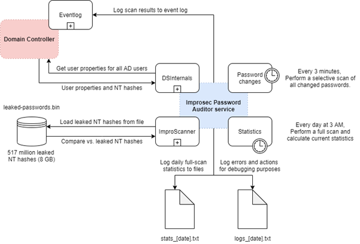

# Improsec Password Auditor (IPA)
[](https://opensource.org/licenses/MIT)   

Monitor the strength and quality of passwords in your Active Directory environment(s).

## Introduction

The following image presents a high-level illustration of the flow between the target Domain Controller and our Improsec Password Auditor service:



Our service contains two timed events – _password changes_ and _statistics_.

The _statistics_ event performs a full password hash extract of the domain and performs password scans for every user in the target segment. The results of this scan are then utilized to calculate general statistics about the given domain, such as the total amount of users utilizing leaked or empty passwords. This event is configured to occur no later than 10 minutes past 3 AM every day.

The _password changes_ event performs a full password extract of the domain and performs password scans for targeted users whose passwords has changed since the last time the event occurred. Upon detection of users employing empty or leaked passwords, an event is written to the event log, effectively notifying the sysadmin of the incident. This event is configured to occur every 3 minutes by default but can be reconfigured using the configuration file as described in the section below.

All password scans are performed using the *ipscan* module, which is a heavily optimized comparison module utilizing the _leaked-passwords.bin_ file, which is a packed binary containing around 517 million leaked NT hashes from the Microsoft Regional Director and MVP, [Troy Hunt](https://github.com/troyhunt).

All password extracts are performed using the DSInternals module, which is a Directory Services module for replicating domain data from Domain Controllers using the MS-DRSR protocol. DSInternals is developed and actively maintained by Security Researcher and Trainer, [Michael Grafnetter](https://github.com/MichaelGrafnetter).

All intermediary actions will be logged to the _logs_ directory, in order to allow end-users to perform a limited type of debugging and locating exceptions when the service fails to deliver.

**IMPORTANT:** We use ICMP to verify that a domain controller for a target server is alive, so any domain controller used by this solution should respond to ICMP echo requests.

It is important that all components are compiled for the same platform (x86 or x64) – otherwise, the solution might encounter problems when attempting to load other subcomponents.

## Configuration
The following configurations are detailed in the *ipsvc.exe.config* file and can be modified to the likings of the end-user. Some of these modifications are required in order to make the server functional. Please note that modifications are loaded upon application start-up, and modifications thus require restarting the service.
* verbose (default = *false*)
	* Toggles the verbosity of the application. When false, informative logs and event logs will be overlooked by the service and thus not written to disk.
* scan_inactive (default = *true*)
	* Toggles whether the scan results written to the event log by the solution should also include results for inactive (disabled) accounts. This parameter does not affect the statistics output.
* account_file (default = *account-state.txt*)
	* This configuration decides the naming of the state file – detailed description of this file and its purpose is depicted in the section below.
* password_file (default = *leaked-passwords.bin*)
	* This configuration decides the naming of the password file – detailed description of this file and its purpose has already been depicted in the section above.
* domain (**required**)
	* This configuration controls the domain name (NetBIOS name) of the domain targeted for domain replication using the DSInternals module. Domain Controllers within this domain will be enumerated in an attempt to find a live Domain Controller for the replication task.
	* **NOTE**: The appropriate value for this field can be retrieved using the *ResolveConfigs.ps1* script.
* context (**required**)
	* This configuration controls the naming context (distinguished name) of the domain targeted for domain replication using the DSInternals module.
	* **NOTE**: The appropriate value for this field can be retrieved using the *ResolveConfigs.ps1* script.
* tickdelay (default = *60000*)
	* This configuration controls the delay (in milliseconds) between distinct password changes events. The default value (*60000*) resolves to a delay-time of approximately 1 minute, which might be too low for domains with a large userbase – tinkering with this value is advised. 

## Directory structure
The following bullet-list depicts the expected structure (layout) of the *ipsvc* root directory:
* /data/
	* leaked-passwords.bin (configurable as detailed in the above section)
		* This file is important to have – otherwise, the service will not have any references for deducing which passwords are considered leaked, and thus will not generate any impactful results.
	* account-state.txt (created and maintained by the service during runtime)
		* This file is responsible for memorizing the state of passwords after each password changes event, and helps the service deduce which passwords has changed since previous events.
* /logs/
	* This directory will be populated by general logs created by the application during runtime.
		*	Format: *logs_[date].txt*
* /statistics/
	*	This directory will be populated by daily statistics reports created during the statistics event.
		*	Format: *stats_[date].txt*
*	/
	*	This directory contains the service executable and all related modules as well as binary configuration files. 
		*	DSInternals.Common 
		*	DSInternals.Replication
		*	DSInternals.Replication.Interop
		*	DSInternals.Replication.Model
		*	ipscan
		*	ipsvc
		*	NDceRpc.Microsoft

## Dependencies

### Microsoft Visual C++ Redistributable Package
Microsoft Visual C++ Redistributable Package is required by our *ipf.dll* filter.

##### Installation step-by-step
* Go to [Microsoft Latest Supported Visual C++ Download](https://support.microsoft.com/en-us/help/2977003/the-latest-supported-visual-c-downloads).
* Download and install the Visual Studio 2017 version of the Visual C++ Redistributable Package for your target platform:
  * For 32-bit systems: vc_redist.x86.exe
  * For 64-bit systems: vc_redist.x64.exe (recommended)
* No restart required.

It is important that the installed version of the Visual C++ Redistributable package matches the platform and the Visual Studio version used to compile the solution (default: x64 with Visual Studio 2017). If not, the DLL will fail to locate its dependencies and will not load.

### Leaked password list
This file contains a binary packed list of leaked password hashes from the PwnedPasswords list published by Troy Hunt. The file is too big (8.5 GB) for GitHub (max 25 MB), so we host it on our SharePoint instead. 

##### Installation step-by-step
* Go to [Improsec Leaked Password List](https://improsec-my.sharepoint.com/:u:/p/vca/EfkYRlAhwlNKuoKOKA6ZG2sByZKnVXfz9bk1vpAFlILxow).
* Download the _leaked-passwords-v6.bin_ file:
	* SHA1: `11f8f33715f76b912328ed688af99c97d42eb3e5`.
* Place the file in the `./Accessible/PasswordLists/` folder.

## Install

Before installing the service, the event log that the service will use for reporting purposes should be created. It is important that the event log has its source set to “ipasvc” – there are no requirements for the name of the event log. This can be done using the following PowerShell command:

```powershell
New-EventLog -Source "ipasvc" -LogName "Improsec Password Auditor"
```

Now the service can be registered as a regular Windows service using the Windows Service Manager (_sc.exe_) or using the following PowerShell command from the root directory of the Improsec Password Auditor service:

```powershell
New-Service -Name "ipsvc" -BinaryPathName "$($pwd)\ipsvc" -DisplayName "Improsec Password Auditor service" -StartupType Automatic
```

Finally, if the binary-packed list of leaked passwords from Troy Hunt *(leaked-password.bin*) does not previously exist in the “data” directory, this should be downloaded and placed in that folder before starting the service, as this is the file referenced by the service to verify if a password is leaked or not.

**NOTE**: A reboot is advised, as an event log is not properly initialized until the next reboot.

## Uninstall

In order to stop and uninstall the Improsec Password Auditor service, it should simply be stopped and deleted using the Windows Service Manager (_sc.exe_) as such:
* `sc.exe stop "ipsvc"`
* `sc.exe delete "ipsvc"`

Optionally, once the service has been deleted, the event log created during the installation process can also be removed using the following PowerShell command:

```powershell
Remove-EventLog -Source "ipasvc"
```

## Usage

Once installed on a server, the service can now be launched from the Services overview on Windows.

**NOTE:** Since the service uses DSInternals to replicate Active Directory objects (i.e. query password hashes), it requires the "*Replicating Directory Changes*" and "*Replicating Directory Changes All*" Active Directory permissions. These are included in e.g. the "*Domain Controller*" default Active Directory group, so running this service on a Domain Controller is ideal.

## Authors
* [**Valdemar Carøe**](https://github.com/st4ckh0und)
* Danske Bank

## License
  
This project is licensed under the MIT License - see the [LICENSE.md](LICENSE.md) file for details

## Acknowledgments

* [Michael Grafnetter](https://github.com/MichaelGrafnetter) for the amazing [DSInternals](https://github.com/MichaelGrafnetter/DSInternals) framework
* [Troy Hunt](https://github.com/troyhunt) for the amazing [PwnedPasswords](https://haveibeenpwned.com/Passwords) list
